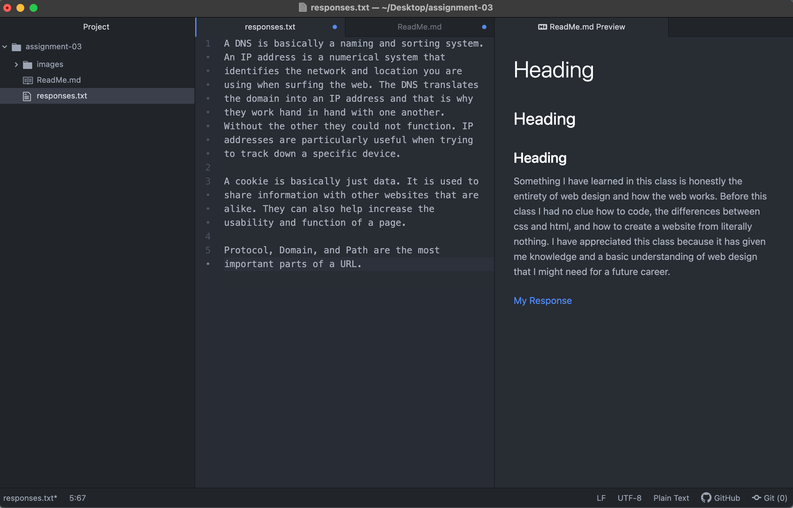

# Heading
## Heading
### Heading

Something I have learned in this class is honestly the entirety of web design and how the web works. Before this class I had no clue how to code, the differences between css and html, and how to create a website from literally nothing. I have appreciated this class because it has given me knowledge and a basic understanding of web design that I might need for a future career.

[My Response](./responses.txt)

