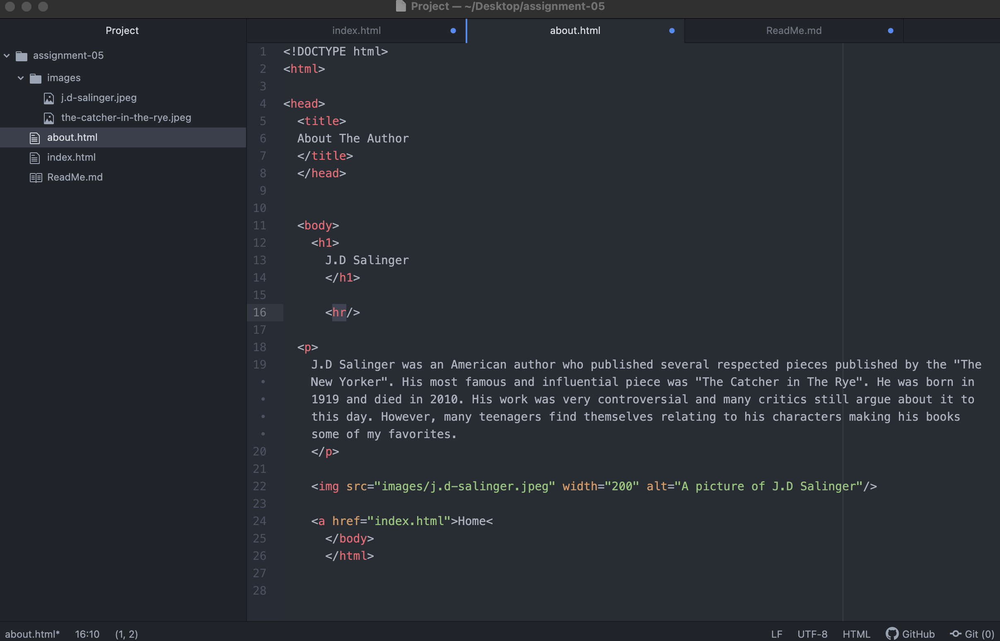

I went on foxnews.com because that's the first one I found that worked dating back to 2000. I went to November of that year because I remembered it was an election year. Immediately I noticed how blocky everything was. It looked like very stereotypical early 2000 web design. In today's modern design of Fox news there is definitely more pictures and color compared to back then. In the 2000 the colors were limited to this beige color and black letters. In the modern design there is also a lot more drop options and navigational items to click on.

