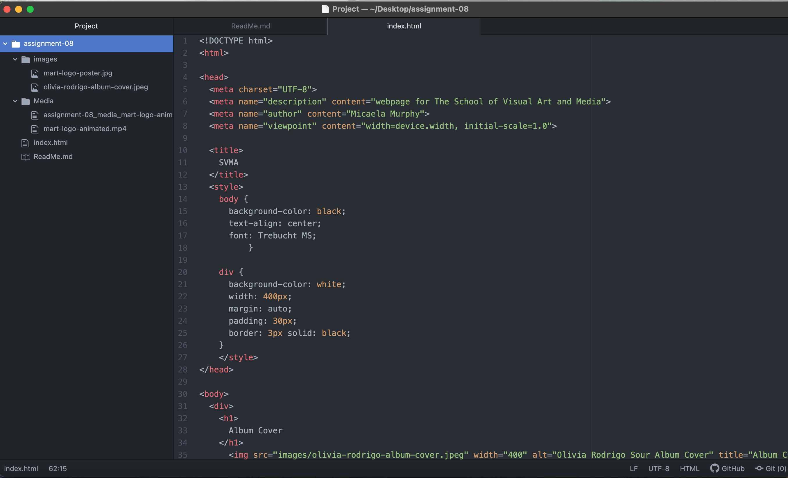

# Heading 1
## Heading 2
### Heading 3

1) An affordance is the action in which you mean for an object. Like a button you press in an elevator. Whether that is up or down is the affordance. It's the intended use by an object.
2) Advantages of using youtube to host my video was how easy it was to embed the video and then place it in my index.html file. A disadvantage is every video I clicked on to use had issues with copyright and viewing my video on my website.
3) A challenge I encountered this week was the copyright issue on the videos I kept trying to use. I looked through and tried at least 10 videos but none of them would let me view it on my website. Unfortunately, I couldn't overcome this and take my loss with this part of the assignment. 
