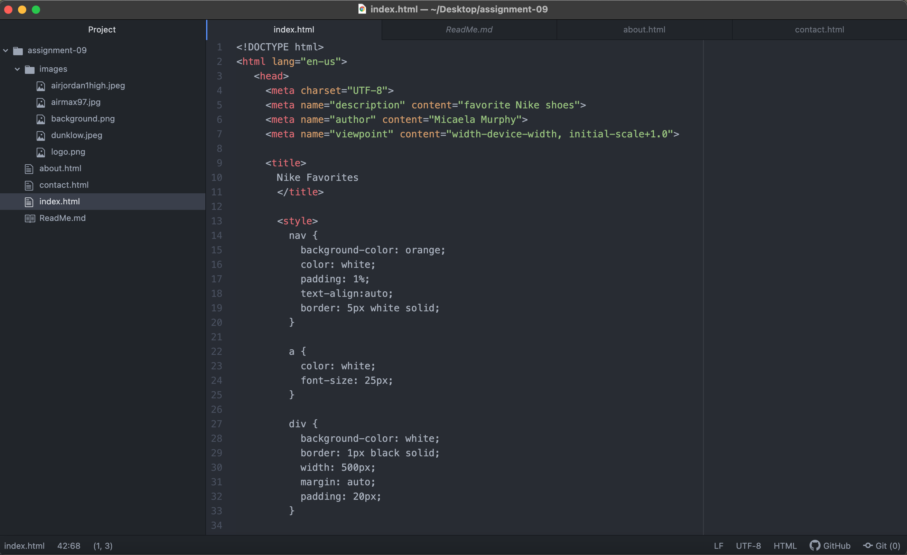
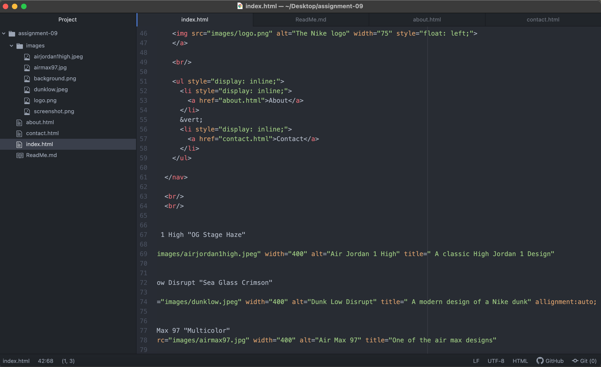
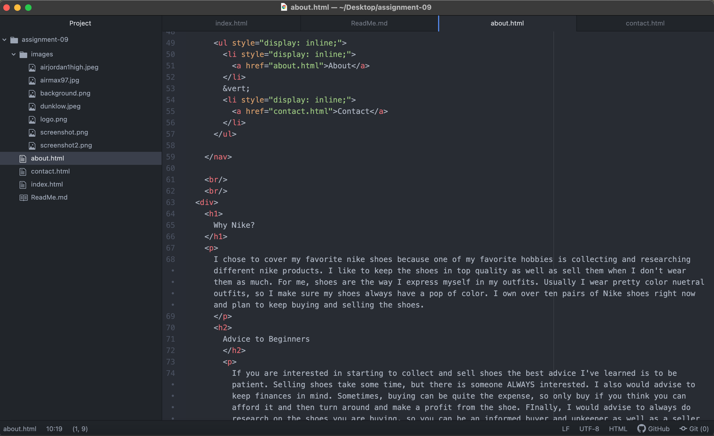
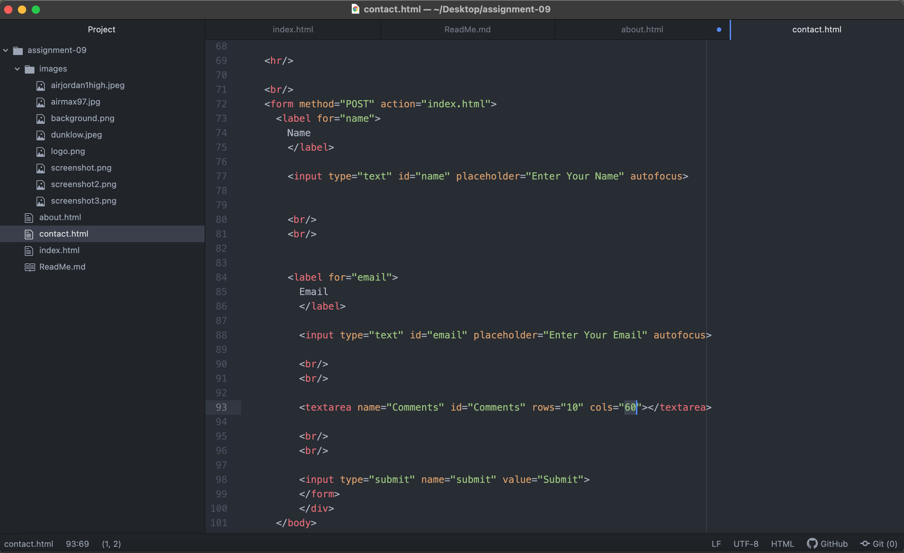

# Heading 1
## Heading 2
### Heading 3

I think until this point html has been extremely confusing and frustrating for me to learn. This has been my first experience with coding, however, with this assignment everything sort of came together and clicked. I learned not everything has to be perfect at the first, it a lot of playing around and seeing how everything connects and looks on your webpage. I think my favorite part about html is the images and inserting images and backgrounds. I feel like my background really pulled my website to look how I wanted it to look. I'm very nervous to start to learn about css because I feel like I just got a little but of a grasp on the development of it all. However, since my favorite part of the assignment this week was decorating my webpage, I think I will really enjoy this next section.

