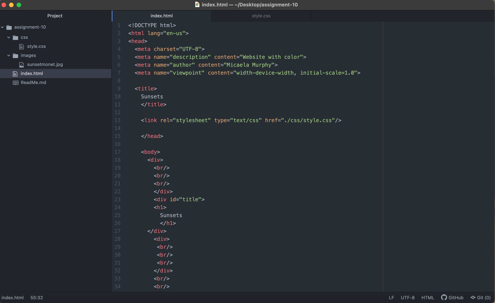
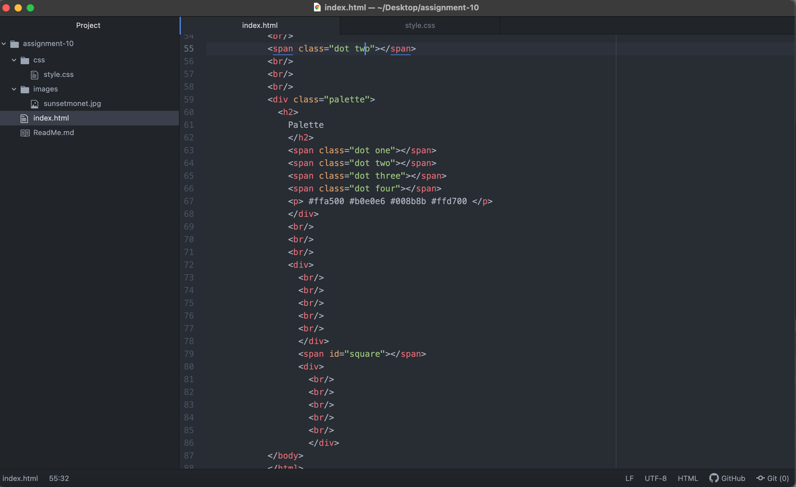
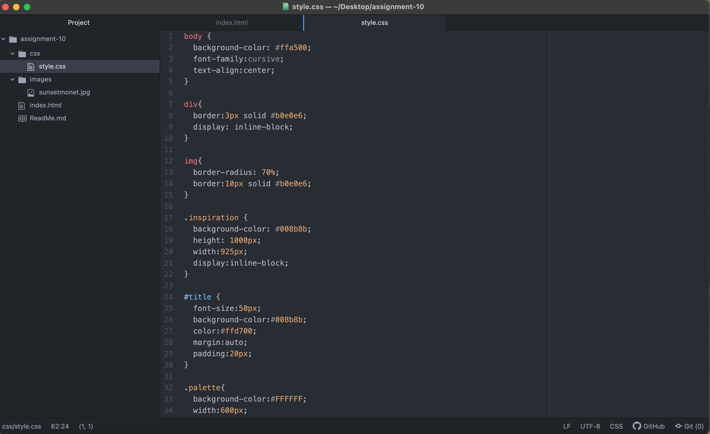
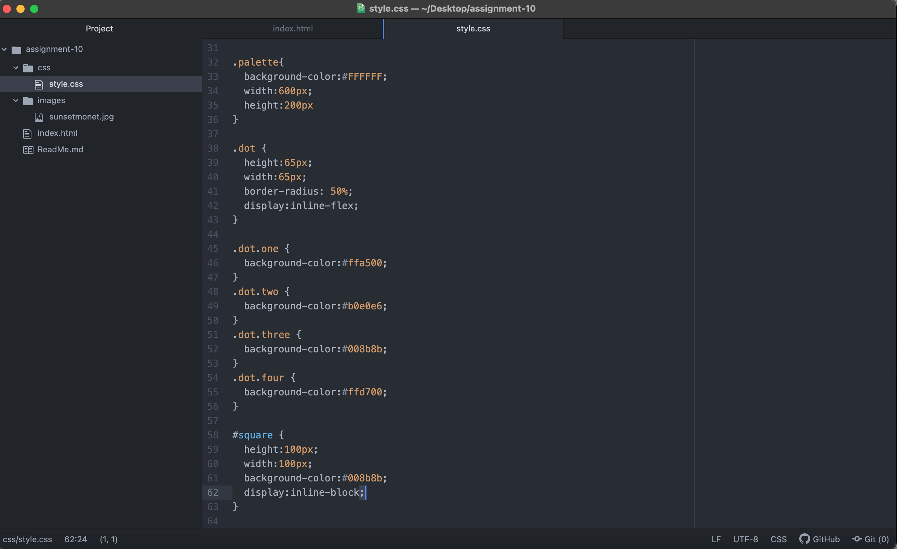

# Heading 1
## Heading 2
## Heading 3

A universal type is used to describe the webpage as a whole. In the readings this week it gave the example of text. when you choose your text type as a universal type the text will be the same on the page no matter if you change the color. The font will stay the same. An element selector is used to do something specific to the text such as changing that color or the boldness of the text. You could change certain sentences to be italicized or bold, but it is very specific to certain sentences and how you want to style those. The class selector is used to make a specific area on the webpage either a different color or height or border. In my project this week I had multiple specific areas on my page where I wanted things to be different such as the background behind my picture and the dot colors. The id selector type is used to make specific elements within an element very specific to how you want it. In the reading it showed you could make different sentences in the same paragraph bold or not. It's helpful to use these different types of selectors because of the functions each of them perform. Each of them style your website in a specific way that the other selector just can't do. Personally I like the class selector the best, because of the wide variety you can do within it.

I chose my colors based off the painting I picked. I tried to incorporate the colors that stood out to me in the painting as my palette. It was honestly kind of hard matching the colors and making them work with one another because they are colors you don't normally see. I personally would not do another website with the colors I chose in my palette, but for the painting I did the colors seemed to work.

