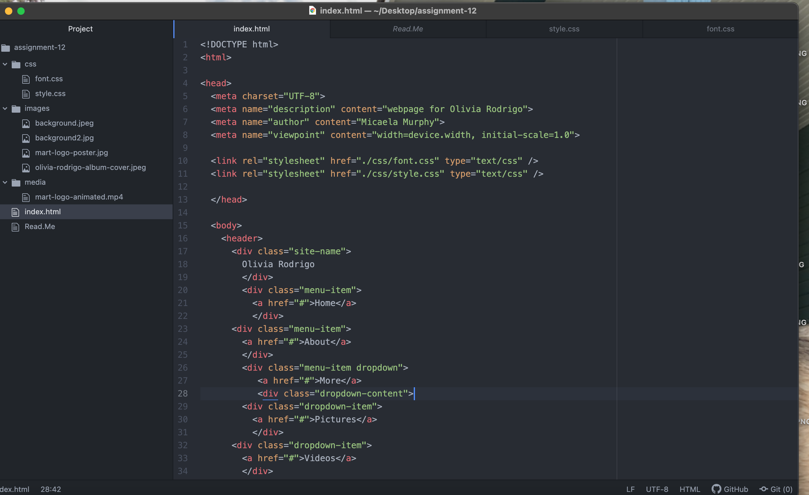
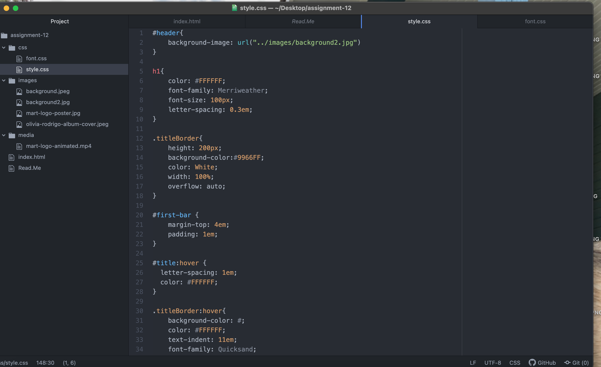
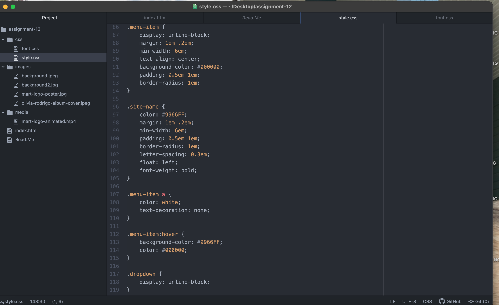
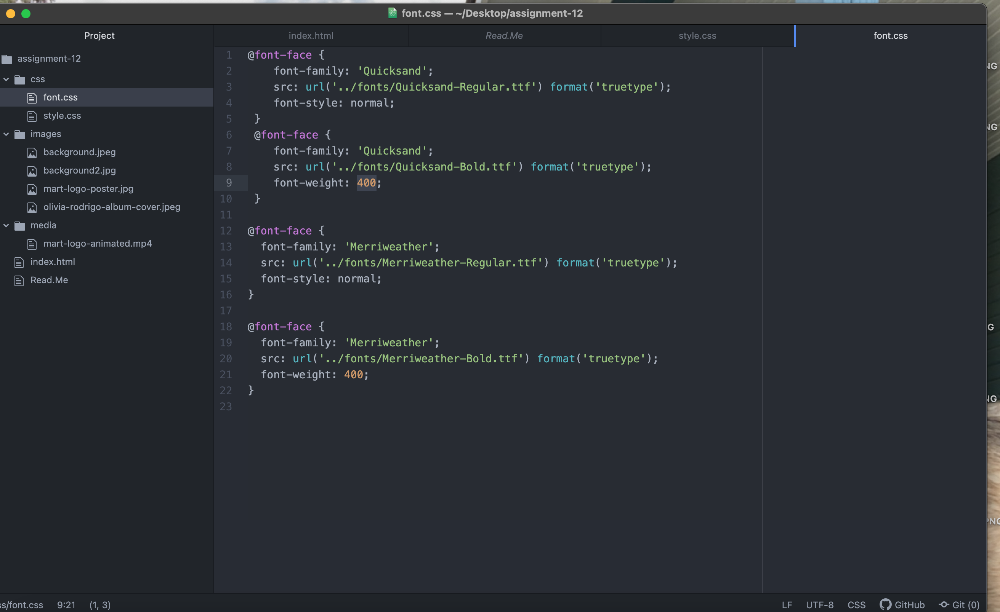

Borders are used for visualizing when spacing out between different items in the website. Within the border you can change the color, style of the border, and width of the border. Padding is used as another tool when figuring out space within the website. Padding helps separate space between the items or contents in the website and the border itself. The margin is the part outside the border that defines the space between elements.

This weeks assignment was very tough for me. It was hard to come up with original fonts that weren't used in the example because I liked the way that font looked with my particular website. Another thing that was difficult was understanding the borders, margins, and padding. I had to play around with them a lot to get my website and elements within the website looking clean. Another thing I played around with this week was the font-weight and discovering what that meant and how it could change the appearance of the font against a background.

